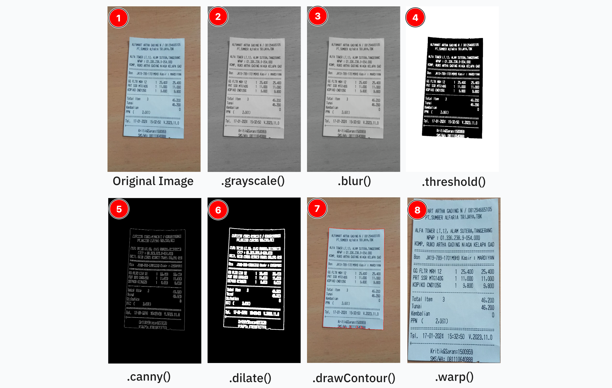

# ppu-ocv

A type-safe, modular, chainable image processing library built on top of OpenCV.js with a fluent API leveraging pipeline processing.



Image manipulation as easy as:

```ts
const processor = new ImageProcessor(canvas);

const result = processor
  .grayscale()
  .blur({ size: 5 })
  .threshold()
  .invert()
  .dilate({ size: [20, 20], iter: 5 })
  .toCanvas();

// Memory cleanup
processor.destroy();
```

This work is based on https://github.com/TechStark/opencv-js.

## Why use this library?

OpenCV is powerful but can be cumbersome to use directly. This library provides:

1. **Simplified API**: Transform complex OpenCV calls into simple chainable methods
2. **Reduced Boilerplate**: No need to manage memory, conversions, or dimensions manually
3. **Development Speed**: Add image processing to your app in minutes, not hours
4. **Extensibility**: Custom operations for your specific needs without library modifications
5. **TypeScript Integration**: Full IntelliSense support with parameter validation

## Installation

Install using your preferred package manager:

```bash
npm install ppu-ocv
yarn add ppu-ocv
bun add ppu-ocv
```

> [!NOTE]
> This project is developed and tested primarily with Bun.  
> Support for Node.js, Deno, or browser environments is **not guaranteed**.  
> If you choose to use it outside of Bun and encounter any issues, feel free to report them.  
> I'm open to fixing bugs for other runtimes with community help.

## Usage

```ts
import { ImageProcessor } from "ppu-ocv";

const file = Bun.file("./assets/receipt.jpg");
const image = await file.arrayBuffer();

const canvas = await ImageProcessor.prepareCanvas(image);
await ImageProcessor.initRuntime();

const processor = new ImageProcessor(canvas);
processor.grayscale().blur({ size: 5 }).threshold();

const resultCanvas = processor.toCanvas();
processor.destroy();
```

Or you can do directly via execute api:

```ts
import { CanvasToolkit, ImageProcessor, cv } from "ppu-ocv";

const file = Bun.file("./assets/receipt.jpg");
const image = await file.arrayBuffer();

const canvasToolkit = new CanvasToolkit();
const canvas = await ImageProcessor.prepareCanvas(image);
await ImageProcessor.initRuntime();

const processor = new ImageProcessor(canvas);
const grayscaleImg = processor.execute("grayscale").toCanvas();

// the pipeline operation continued from grayscaled image
const thresholdImg = processor
  .execute("blur")
  .execute("threshold", {
    type: cv.THRESH_BINARY_INV + cv.THRESH_OTSU,
  })
  .toCanvas();

await canvasToolkit.saveImage({
  canvas: thresholdImg,
  filename: "threshold",
  path: "out",
});
```

For more advanced usage, see: [Example usage of ppu-ocv](./examples)

## Built-in pipeline operations

To avoid bloat, we only ship essential operations for chaining. Currently shipped operations are:

```ts
"adaptiveThreshold" |
  "blur" |
  "border" |
  "canny" |
  "dilate" |
  "erode" |
  "grayscale" |
  "invert" |
  "morphologicalGradient" |
  "resize" |
  "threshold" |
  "warp";
```

## Extending operations

You can easily add your own by creating a prototype method or extend the class of `ImageProcessor`.

See: [How to extend ppu-ocv operations](./docs/how-to-extend-ppu-ocv-operations.md)

## Class documentation

#### `ImageProcessor`

| Method                 | Args             | Description                                                                 |
| ---------------------- | ---------------- | --------------------------------------------------------------------------- |
| constructor            | cv.Mat or Canvas | Instantiate processor with initial image                                    |
| static `prepareCanvas` | ArrayBuffer      | Utility to load image from file buffer to canvas                            |
| static `initRuntime`   |                  | Important open-cv runtime initialization, required to call once per runtime |
| operations             | depends          | Chainable operations like `blur`, `grayscale`, `resize` and so on           |
| `execute`              | name, options    | Chainable operations directly via `execute` api                             |
| outputs                |                  | Non-chainable & non-interupting method for output like `toMat`, `toCanvas`  |
| `destroy`              |                  | Non-chainable clean-up memory to destroy the object and the state           |

#### `CanvasToolkit`

| Method        | Args                   | Description                                                                               |
| ------------- | ---------------------- | ----------------------------------------------------------------------------------------- |
| `crop`        | BoundingBox, Canvas    | Crop a part of source canvas and return a new canvas of the cropped part                  |
| `isDirty`     | Canvas, threshold      | Check whether a binary canvas is dirty (full of major color either black or white) or not |
| `saveImage`   | Canvas, filename, path | Save a canvas to an image file                                                            |
| `clearOutput` | path                   | Clear the output folder                                                                   |
| `drawLine`    | ctx, coordinate, style | Draw a non-filled rectangle outline on the canvas                                         |
| `drawContour` | ctx, contour, style    | Draw a contour on the canvas                                                              |

#### `Contours`

| Method                  | Args            | Description                                                                               |
| ----------------------- | --------------- | ----------------------------------------------------------------------------------------- |
| constructor             | cv.Mat, options | Instantiate Contours and automatically find & store contour list from args                |
| `getAll`                |                 | Crop a part of source canvas and return a new canvas of the cropped part                  |
| `getFromIndex`          | index           | Get contour at a specific index                                                           |
| `getRect`               |                 | Get the rectangle that bounds the contour                                                 |
| `iterate`               | callback        | Iterate over all contours and call the callback function for each contour                 |
| `getLargestContourArea` |                 | Get the largest contour area                                                              |
| `getCornerPoints`       | Canvas, contour | Get four corner points for a given contour. Useful for perspective transformation (warp). |
| `destroy`               |                 | Destroy & clean-up the memory from the contours                                           |

#### `ImageAnalysis`

Just a collection of utility functions for analyzing image properties.

- `calculateMeanNormalizedLabLightness`: Calculates the mean normalized lightness of an image using the L channel of the Lab color space. Lightness is normalized based on the image's own maximum lightness value before averaging.

- `calculateMeanGrayscaleValue`: Calculates the mean pixel value of the image after converting it to grayscale.

## Contributing

Contributions are welcome! If you would like to contribute, please follow these steps:

1. **Fork the Repository:** Create your own fork of the project.
2. **Create a Feature Branch:** Use a descriptive branch name for your changes.
3. **Implement Changes:** Make your modifications, add tests, and ensure everything passes.
4. **Submit a Pull Request:** Open a pull request to discuss your changes and get feedback.

### Running Tests

This project uses Bun for testing. To run the tests locally, execute:

```bash
bun test
```

Ensure that all tests pass before submitting your pull request.

## Scripts

Recommended development environment is in linux-based environment.

Library template: https://github.com/aquapi/lib-template

All script sources and usage.

### [Build](./scripts/build.ts)

Emit `.js` and `.d.ts` files to [`lib`](./lib).

### [Publish](./scripts/publish.ts)

Move [`package.json`](./package.json), [`README.md`](./README.md) to [`lib`](./lib) and publish the package.

## License

This project is licensed under the MIT License. See the [LICENSE](LICENSE) file for details.

## Support

If you encounter any issues or have suggestions, please open an issue in the repository.

Happy coding!
